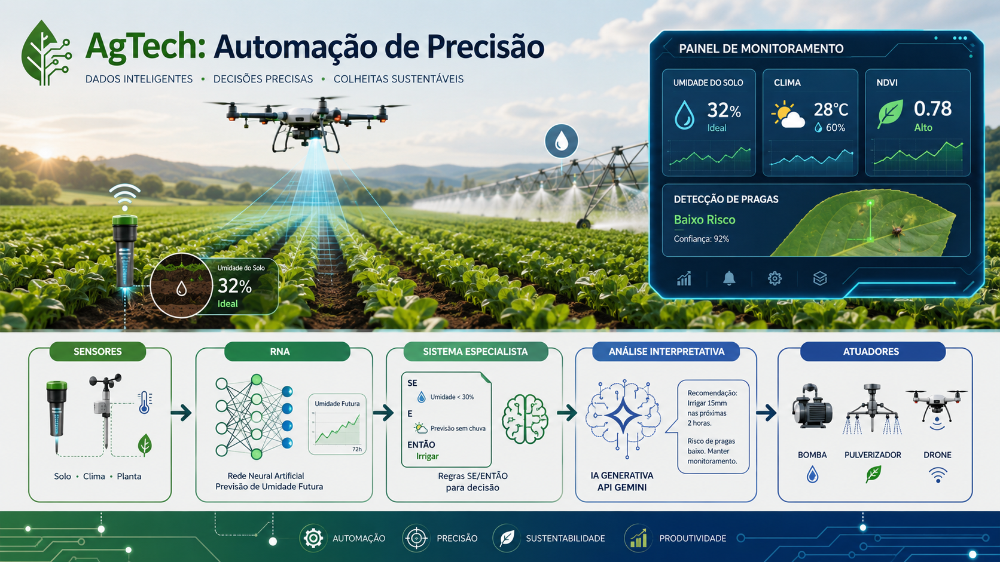
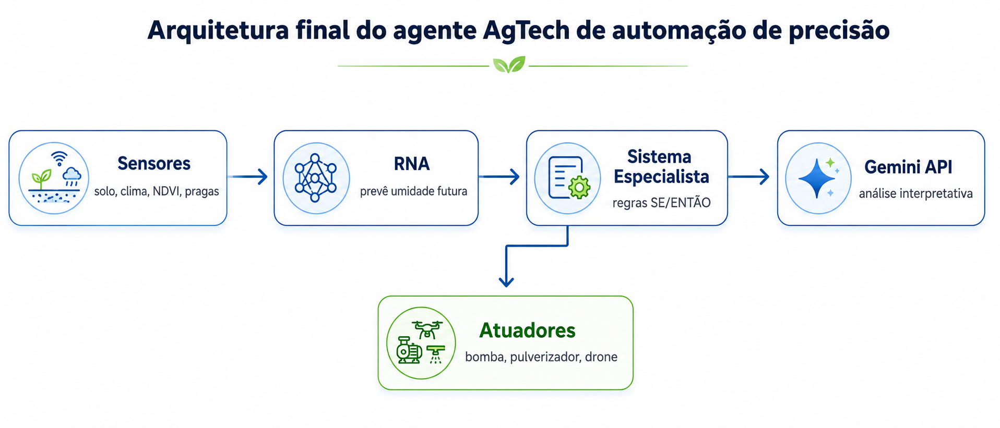
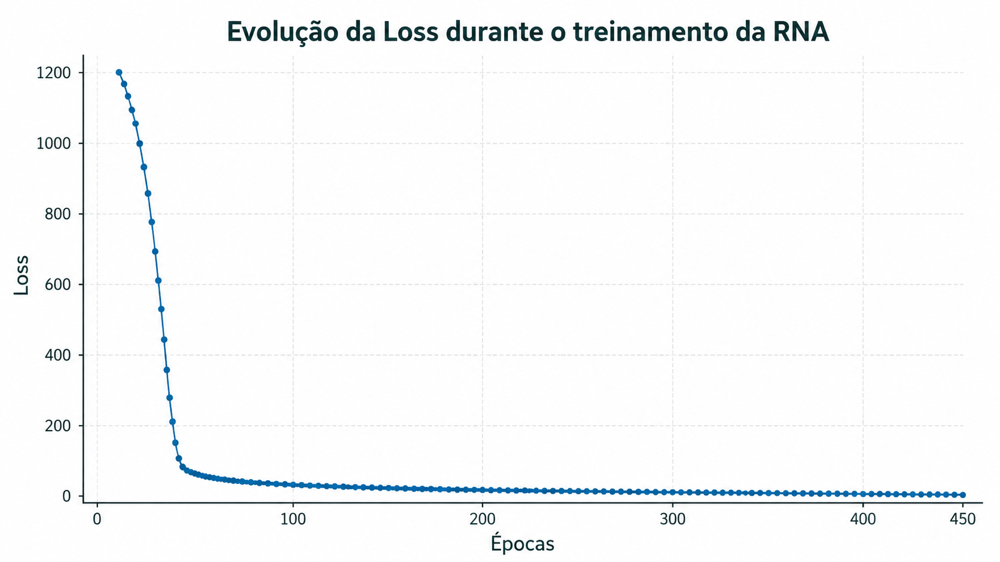
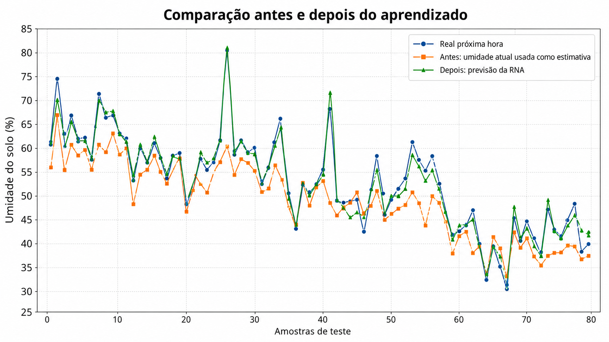
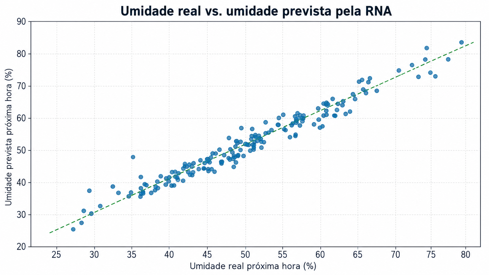
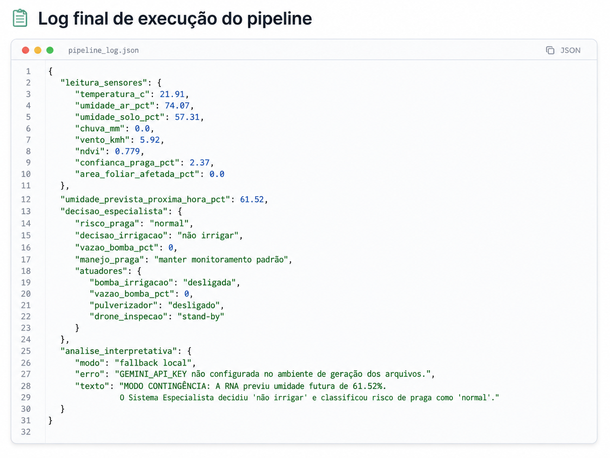

# AgTech: Automação de Precisão com RNA, Sistema Especialista e Gemini




## 1. Diagnóstico e formulação do problema

O projeto resolve uma dor real da agricultura de precisão: **a tomada de decisão tardia ou imprecisa sobre irrigação e controle de pragas**. Em muitas lavouras, a inspeção visual manual e a irrigação por calendário ainda são usadas como referência principal. Esse método pode desperdiçar água, atrasar a resposta contra pragas, aumentar o custo com defensivos e reduzir produtividade.

A solução proposta utiliza IA para transformar esse processo porque o agente deixa de apenas observar o estado atual da lavoura e passa a **prever, decidir e explicar**. A Rede Neural Artificial antecipa a umidade do solo na próxima hora; o Sistema Especialista converte essa previsão e os dados de pragas em ações de controle; e a API Gemini gera uma interpretação técnica em linguagem natural para apoiar produtor, técnico agrícola ou gestor.

## 2. Objetivo do agente

Desenvolver um agente AgTech capaz de executar o fluxo:

```text
Sensores -> Previsão por RNA -> Sistema Especialista -> Gemini/Fallback -> Atuadores
```

O agente deve decidir, com base em dados simulados de campo, se deve:

- irrigar ou não irrigar;
- definir a vazão da bomba;
- classificar risco de pragas;
- acionar pulverizador ou drone de inspeção;
- gerar uma explicação técnica interpretável.

## 3. Modelagem PEAS

| Elemento PEAS | Definição no projeto |
|---|---|
| **Performance** | Reduzir erro de previsão de umidade, evitar irrigação desnecessária, responder rapidamente a risco de pragas e manter decisão explicável. |
| **Environment** | Lavoura monitorada por sensores de solo, clima, NDVI e visão computacional embarcada em drone/robô agrícola. |
| **Actuators** | Bomba de irrigação, controle de vazão, pulverizador localizado e drone de inspeção. |
| **Sensors** | Temperatura, umidade do ar, umidade do solo, chuva, vento, NDVI, confiança de praga e área foliar afetada. |

## 4. Requisitos funcionais e não funcionais

### Requisitos funcionais

| Código | Requisito |
|---|---|
| RF01 | Ler dados de sensores agrícolas simulados. |
| RF02 | Validar dados ausentes, nulos ou fora de faixa. |
| RF03 | Treinar uma RNA para prever a umidade do solo na próxima hora. |
| RF04 | Enviar a previsão da RNA para o Sistema Especialista. |
| RF05 | Aplicar regras SE/ENTÃO para irrigação e manejo de pragas. |
| RF06 | Definir estado dos atuadores: bomba, vazão, pulverizador e drone. |
| RF07 | Enviar o resultado técnico para a API Gemini. |
| RF08 | Gerar fallback local se a API Gemini falhar ou a chave não estiver configurada. |
| RF09 | Salvar métricas, logs e imagens para documentação no GitHub. |

### Requisitos não funcionais

| Código | Requisito |
|---|---|
| RNF01 | O notebook deve rodar no Google Colab do início ao fim. |
| RNF02 | O código deve ser limpo, comentado e sem células de rascunho. |
| RNF03 | A estrutura do repositório deve seguir pastas claras: `/notebooks`, `/data`, `/src`, `/logs`, `/assets/images` e `/docs`. |
| RNF04 | A execução não deve quebrar abruptamente diante de falhas previsíveis. |
| RNF05 | O README deve conter evidências visuais, métricas e passo a passo de execução. |

## 5. Arquitetura final



## 6. Modelo de aprendizado — RNA

A abordagem escolhida na Etapa 3 foi **Opção A — Redes Neurais Artificiais**. A RNA foi escolhida porque o problema exige previsão de comportamento futuro: a decisão de irrigar fica mais eficiente quando o agente estima a **umidade do solo na próxima hora**, em vez de usar somente a umidade atual.

### Métricas obtidas

| Métrica | Resultado |
|---|---:|
| MAE da RNA | 1.831 |
| RMSE da RNA | 2.372 |
| R² da RNA | 0.952 |
| MAE sem aprendizado | 4.501 |
| RMSE sem aprendizado | 6.228 |
| Ganho percentual de MAE | 59.33% |
| Épocas treinadas | 453 |

Esses resultados indicam que o modelo aprendeu um padrão útil, pois reduziu o erro em comparação ao método simples de usar a umidade atual como estimativa da próxima hora.

## 7. Evidências visuais e métricas

### Curva de Loss



### Comparação antes e depois do aprendizado



### Umidade real vs. umidade prevista



### Log final do pipeline



## 8. Sistema Especialista — lógica de controle

O Sistema Especialista foi escolhido para a decisão técnica por trabalhar bem com diagnósticos baseados em regras claras. A RNA prevê a umidade futura, mas quem toma a decisão de controle é a base de conhecimento.

### Regras principais

| Condição | Decisão |
|---|---|
| SE umidade prevista < 22% E chuva < 2,5 mm | Irrigação crítica, bomba em 100%. |
| SE umidade prevista < 32% E chuva < 2,5 mm | Irrigação moderada, bomba em 65%. |
| SE umidade prevista < 42% | Monitorar umidade, bomba em 25%. |
| SE umidade prevista >= 42% | Não irrigar. |
| SE confiança de praga >= 85% E área foliar >= 35% | Risco crítico. |
| SE confiança de praga >= 70% E área foliar >= 25% | Risco alto. |
| SE risco alto/crítico E vento < 18 km/h | Acionar pulverização localizada. |
| SE risco alto/crítico E vento >= 18 km/h | Bloquear pulverização por segurança e acionar inspeção por drone. |

## 9. Integração com Gemini API

A API Gemini é usada apenas como camada interpretativa. Ela **não substitui** a decisão técnica do Sistema Especialista. O prompt solicita uma explicação contextual com:

1. previsão da RNA;
2. regras acionadas;
3. atuadores definidos;
4. alertas estratégicos de campo;
5. limitação dos dados simulados.

Se `GEMINI_API_KEY` não estiver configurada ou a API falhar, o projeto aciona um fallback local. Assim, o pipeline continua executando e registra a falha de forma controlada.

## 10. Tratamento de exceções

| Risco de falha | Tratamento implementado |
|---|---|
| Dataset vazio | Gera erro controlado e log explicativo. |
| Colunas obrigatórias ausentes | Informa exatamente quais colunas faltam. |
| Valores nulos | Preenche com mediana quando possível. |
| Valores fora de faixa | Aplica limites aceitáveis por sensor. |
| Leitura individual inválida | Bloqueia a inferência e informa o campo problemático. |
| API Gemini indisponível | Usa fallback local e mantém o pipeline operacional. |
| Erro inesperado | Salva `logs/log_erro_controlado.json`. |

## 11. Estrutura do repositório

```text
.
├── README.md
├── requirements.txt
├── CHECKLIST_ETAPA4.md
├── notebooks/
│   └── AgTech_Etapa4_Validacao_Final.ipynb
├── data/
│   └── sensores_agtech_simulados.csv
├── src/
│   └── pipeline_final_agtech.py
├── logs/
│   ├── log_pipeline_final.json
│   └── metricas_modelo_final.json
├── assets/
│   └── images/
│       ├── agtech_visao_geral_projeto.png
│       ├── arquitetura_pipeline_agtech.png
│       ├── grafico_loss_rna.png
│       ├── comparacao_antes_depois.png
│       ├── previsao_vs_real_rna.png
│       └── log_execucao_pipeline.png
└── docs/
    ├── apendice_uso_ia.md
    └── roteiro_video_pitch.md
```

> Atenção: para entrega no GitHub, não envie `.zip` ou `.rar`. Envie os arquivos expostos nas pastas do repositório.

## 12. Como executar no Google Colab

1. Abra o notebook:

```text
notebooks/AgTech_Etapa4_Validacao_Final.ipynb
```

2. Execute a instalação:

```python
%pip install -q -U numpy pandas matplotlib scikit-learn google-genai
```

3. Configure a chave do Gemini nos Secrets do Colab:

```text
Nome do segredo: GEMINI_API_KEY
Valor: sua chave da API
```

4. Execute todas as células em sequência.

5. Verifique os arquivos gerados:

```text
logs/log_pipeline_final.json
logs/metricas_modelo_final.json
assets/images/
```

O notebook também roda sem a chave Gemini, mas nesse caso a análise interpretativa será gerada em modo de contingência local.

## 13. Checklist de aderência à rubrica

| Critério | Status no projeto |
|---|---|
| Diagnóstico e problema | Dor clara: desperdício hídrico, atraso na resposta a pragas e perda de produtividade. |
| PEAS e requisitos | PEAS, RFs e RNFs documentados. |
| Lógica de controle | Sistema Especialista com regras SE/ENTÃO e regras acionadas no log. |
| Gemini | Prompt contextual e fallback seguro. |
| RNA | Modelo treinado com métricas, baseline e ganho percentual. |
| Pipeline e exceções | Fluxo completo e try/except contra falhas previsíveis. |
| Clean Code | Código organizado em funções, variáveis claras e comentários técnicos. |
| GitHub/README | Estrutura de pastas, passo a passo e apêndice de IA. |
| Evidências visuais | Imagens em `/assets/images` e métricas no README. |
| Pitch | Roteiro pronto em `/docs/roteiro_video_pitch.md`; falta apenas inserir o link real do vídeo após gravação. |

## 14. Link do vídeo de demonstração

Substitua o campo abaixo pelo link público do YouTube ou Google Drive:

```text
LINK_DO_VIDEO: inserir_link_publico_aqui
```

O vídeo deve ter 2 a 3 minutos e mostrar: repositório, execução do notebook, curva de Loss, comparação antes/depois, log final e inferência do Gemini.

## 15. Apêndice de IA

Este projeto utilizou IA de forma assistiva para estruturar o pipeline, revisar a documentação e apoiar a geração de explicações textuais. A decisão técnica do agente não é tomada pela IA generativa: ela é tomada pela RNA e pelo Sistema Especialista. A API Gemini atua apenas como camada de interpretação e comunicação.

Mais detalhes: [`docs/apendice_uso_ia.md`](docs/apendice_uso_ia.md)
