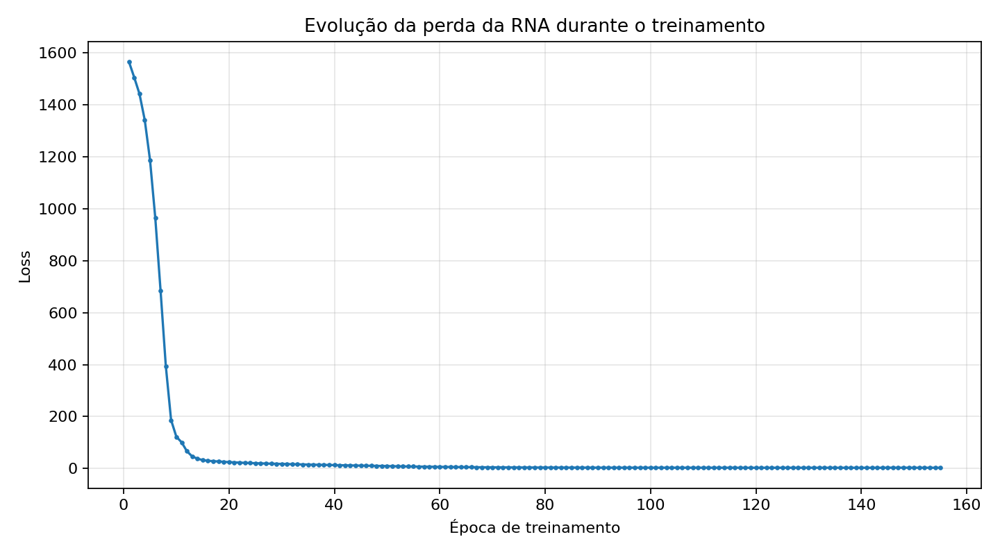
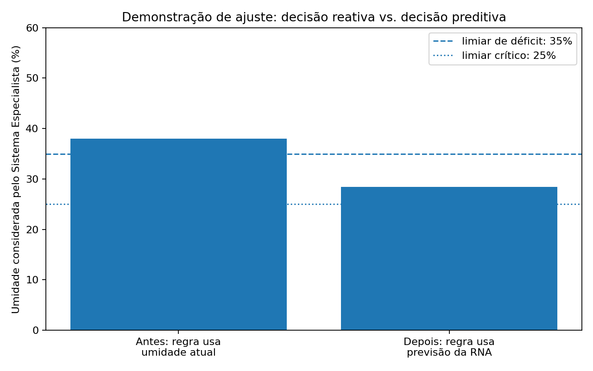
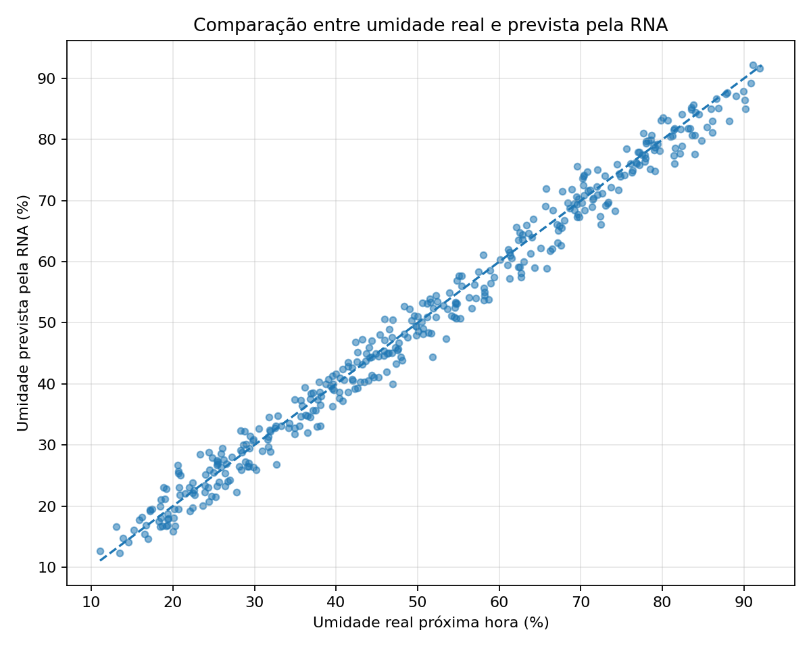

# AgTech: Automação de Precisão — Etapa 3

## Tema

**AgTech: Automação de Precisão** — sistema para drones ou robôs agrícolas que identificam pragas por visão computacional e gerenciam recursos hídricos no campo.

## Continuidade das etapas anteriores

Na Etapa 2, o sistema utilizava um **Sistema Especialista** com regras do tipo SE/ENTÃO para decidir ações de irrigação e manejo de pragas. Nesta Etapa 3, foi adicionada uma camada de **aprendizado preditivo** para que o agente não dependa apenas da leitura atual dos sensores.

## Abordagem escolhida

A abordagem escolhida foi a **Opção A — Redes Neurais Artificiais (RNA)**.

A RNA foi escolhida porque o problema de irrigação exige antecipação. Em vez de o agente reagir apenas à umidade atual do solo, a rede neural aprende padrões dos sensores e prevê a **umidade do solo na próxima hora**. Esse valor previsto alimenta o Sistema Especialista da Etapa 2, tornando a decisão mais preventiva.

## Arquitetura lógica

```text
Sensores da Etapa 1
│
├── Umidade do solo atual (%)
├── Temperatura (°C)
├── Umidade do ar (%)
├── Velocidade do vento (km/h)
├── Chuva prevista (mm)
├── Evapotranspiração estimada (mm/h)
├── Confiança da visão computacional para praga
└── Dano foliar estimado (%)
        │
        ▼
Rede Neural Artificial — MLPRegressor
        │
        ▼
Previsão da umidade do solo na próxima hora
        │
        ▼
Sistema Especialista da Etapa 2
        │
        ├── Classificação de risco hídrico
        ├── Classificação de risco de praga
        └── Definição dos atuadores
                │
                ├── Bomba/válvula de irrigação
                ├── Drone/robô de pulverização localizada
                └── Alerta ao agrônomo
                        │
                        ▼
Gemini API — Análise Interpretativa
```

## Função da RNA

A rede neural foi implementada com `MLPRegressor`, da biblioteca Scikit-Learn. Ela recebe os dados dos sensores e retorna a previsão da variável:

```text
umidade_solo_prox_hora_pct
```

Esse valor é usado como entrada no Sistema Especialista. Assim, a lógica de decisão deixa de ser apenas reativa e passa a ser preditiva.

## Métricas de desempenho

No teste com dados simulados, o modelo obteve:

- **MAE:** 2.114 pontos percentuais de umidade
- **RMSE:** 2.604 pontos percentuais de umidade
- **R²:** 0.985
- **Épocas treinadas:** 155

## Gráfico de desempenho

O gráfico abaixo mostra a queda da perda durante o treinamento da RNA:



## Comparação visual antes e depois do aprendizado

Antes do aprendizado, o Sistema Especialista usava a umidade atual do solo. Depois do aprendizado, ele usa a umidade prevista para a próxima hora.



## Resultado da previsão

Também foi gerado um gráfico comparando a umidade real com a umidade prevista pela RNA:



## Integração com Gemini API

O Gemini não toma a decisão técnica. A decisão continua sendo feita pelo Sistema Especialista. O Gemini recebe:

- dados dos sensores;
- previsão da RNA;
- decisão antes do aprendizado;
- decisão depois do aprendizado;
- atuadores acionados;
- principais sensores que influenciaram o modelo.

A função do Gemini é gerar uma explicação em linguagem natural sobre o que o modelo aprendeu e por que a decisão final foi tomada.

## Como rodar no Google Colab

1. Abra o notebook `AgTech_Etapa3_RNA_SistemaEspecialista_Gemini.ipynb`.
2. Execute a célula de instalação das bibliotecas.
3. Configure sua chave da API Gemini no Colab.

Você pode cadastrar no painel de Secrets do Colab uma variável chamada `GEMINI_API_KEY` ou usar variável de ambiente:

```python
import os
os.environ["GEMINI_API_KEY"] = "SUA_CHAVE_AQUI"
```

4. Execute todas as células do notebook.
5. Ao final, o notebook irá gerar:

- gráfico de loss;
- comparação antes/depois;
- logs da decisão;
- análise interpretativa do Gemini.

## Arquivos principais

```text
AgTech_Etapa3_RNA_SistemaEspecialista_Gemini.ipynb
README.md
requirements.txt
dados_sensores_simulados.csv
imagens/grafico_loss_rna.png
imagens/comparacao_antes_depois.png
imagens/previsao_vs_real_rna.png
logs/log_integracao_etapa3.json
logs/importancia_sensores_rna.csv
```

## Exemplo de log de saída

```json
{
  "abordagem_etapa3": "Redes Neurais Artificiais - MLPRegressor/Scikit-Learn",
  "objetivo_modelo": "Prever a umidade do solo da próxima hora para antecipar a decisão de irrigação do Sistema Especialista da Etapa 2.",
  "metricas": {
    "MAE_pct_umidade": 2.114,
    "RMSE_pct_umidade": 2.604,
    "R2": 0.985,
    "epocas_treinadas": 155
  },
  "cenario_teste": {
    "umidade_solo_atual_pct": 38.0,
    "temperatura_c": 34.5,
    "umidade_ar_pct": 43.0,
    "vento_kmh": 14.5,
    "chuva_prevista_mm": 0.5,
    "evapotranspiracao_mm_h": 3.9,
    "confianca_praga_visao": 0.82,
    "dano_foliar_pct": 28.0
  },
  "decisao_antes_aprendizado": {
    "risco_praga": "ALTO",
    "risco_hidrico": "ADEQUADO",
    "acao_irrigacao": "MANTER irrigação desligada; solo em faixa adequada",
    "vazao_irrigacao_pct": 0,
    "acao_manejo_praga": "Realizar inspeção direcionada e controle localizado preventivo"
  },
  "umidade_prevista_rna_pct": 28.4,
  "decisao_depois_aprendizado": {
    "risco_praga": "ALTO",
    "risco_hidrico": "DÉFICIT",
    "acao_irrigacao": "ACIONAR irrigação em nível MÉDIO e reavaliar em 1 hora",
    "vazao_irrigacao_pct": 60,
    "acao_manejo_praga": "Realizar inspeção direcionada e controle localizado preventivo"
  },
  "top_sensores_aprendidos": [
    {
      "sensor": "umidade_solo_atual_pct",
      "importancia_media": 21.867338003456588
    },
    {
      "sensor": "chuva_prevista_mm",
      "importancia_media": 2.8612422321013526
    },
    {
      "sensor": "evapotranspiracao_mm_h",
      "importancia_media": 1.079331562839115
    },
    {
      "sensor": "confianca_praga_visao",
      "importancia_media": 0.07276992279090116
    },
    {
      "sensor": "temperatura_c",
      "importancia_media": 0.04422837902677157
    }
  ]
}
```

## Conclusão

A Etapa 3 adicionou capacidade de previsão ao agente AgTech. Com a RNA, o sistema passa a antecipar a queda de umidade do solo e alimenta o Sistema Especialista com uma informação mais inteligente. Dessa forma, o agente pode acionar irrigação de maneira preventiva, priorizar áreas com risco de praga e gerar explicações estratégicas com apoio da API do Gemini.
